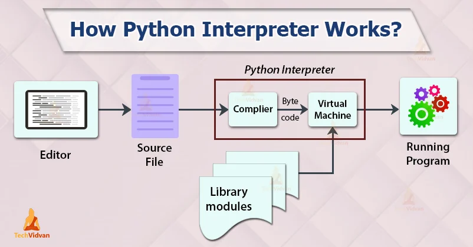
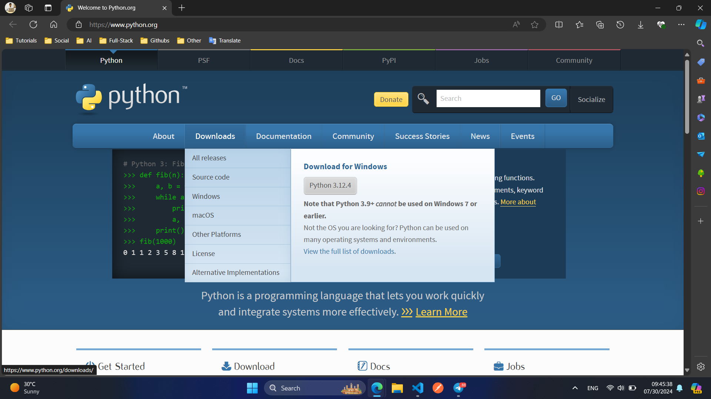
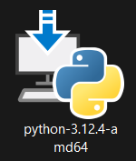
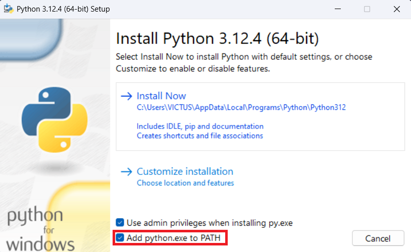
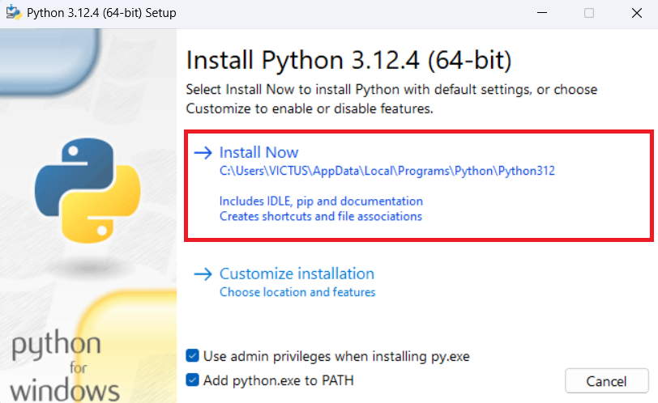
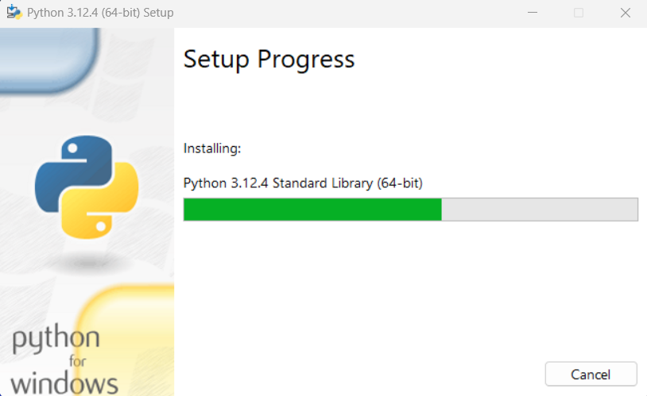
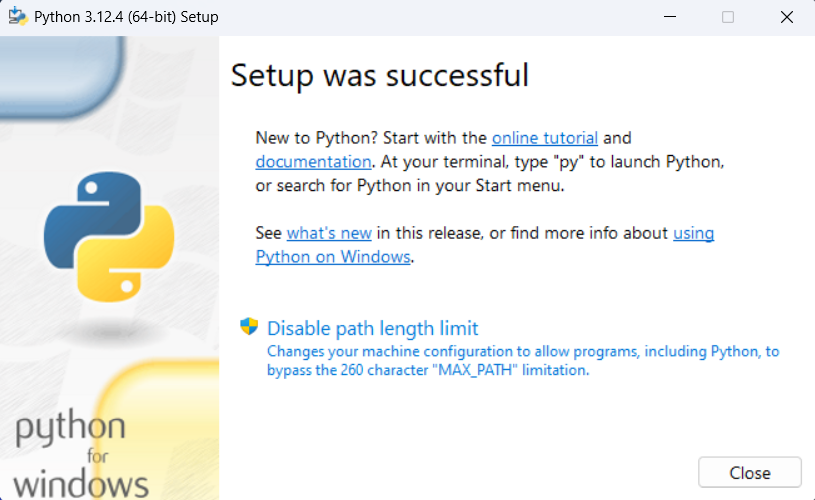
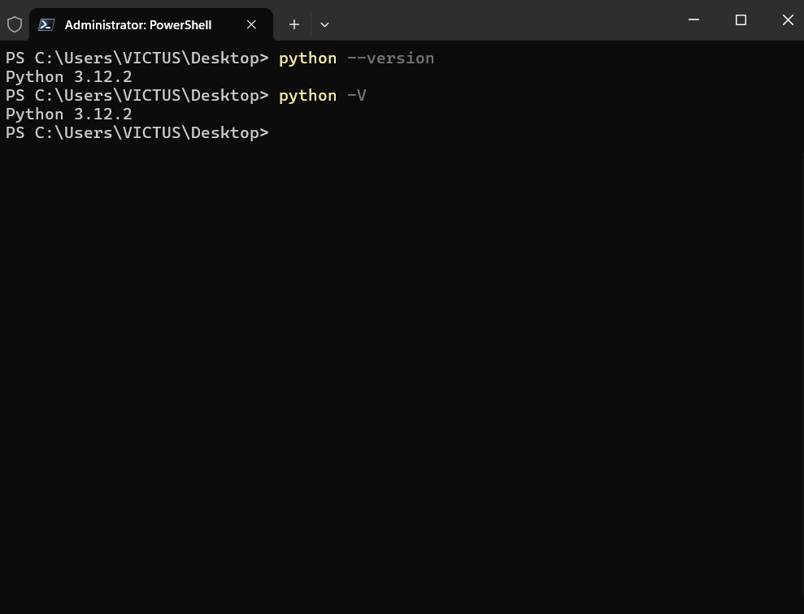

# 🐍 PYTHON DASTURLASH ASOSLARI

# 🧩 WHAT IS PYTHON?

📌 Python — bu yuqori darajadagi, umumiy maqsadli, interpreted dasturlash tili. U soddaligi, oson sintaksisi, o‘qilishi qulayligi bilan mashhur.

📌 **High-Level Programming Language**: bu inson o‘qishi va tushunishi oson bo‘lgan dasturlash tili degani. Kompyuterlar past darajadagi tillarda ishlaydi (masalan: Assembly, Machine Code), ammo bu tillar inson uchun tushunish qiyin.

✳️ Python esa odam tiliga yaqin bo‘lib yoziladi:

```python
print("Salom, dunyo!")  # Ekranga matn chiqarish
```
📌 Bu buyruqni har kim tushunadi. Ammo past darajadagi tillarda xuddi shu ishni qilish juda murakkab bo‘ladi.

📌 Yuqori darajadagi tillarning afzalliklari:

- Sintaksisi oddiy va oson
- O‘rganish va tushunish qulay
- Ko‘p platformalarda ishlaydi
- Kam kod bilan ko‘p ishni bajaradi

📌 **General-Purpose Programming Language**: bu har xil dasturlarni yaratish uchun ishlatiladigan dasturlash tili.

✳️ Python yordamida quyidagilarni qilish mumkin:

- 🌐 Web dasturlar (Django, Flask)
- 🤖 Sun'iy intellekt (AI, ML)
- 📊 Ma’lumotlar tahlili (Pandas, NumPy)
- 🖥️ Desktop ilovalar
- 📱 Mobil ilovalar (Kivy, BeeWare)
- 🎮 O‘yinlar (Pygame)
- 🧪 Ilmiy hisob-kitoblar
- 🛠️ Avtomatlashtirish va skriptlar

| Tushuncha         | Ma'nosi                                                     |
|-------------------|-------------------------------------------------------------|
| Yuqori darajadagi | Inson o‘qishi oson, sodda sintaksisga ega dasturlash tili   |
| Umumiy maqsadli   | Turli sohalarda foydalanish mumkin bo‘lgan dasturlash tili  |

## ✅ PYTHON TARIXI

✳️ Python asoschisi: Guido van Rossum

- Guido van Rossum — Gollandiyalik dasturchi.
- 1980-yillarda CWI (Centrum Wiskunde & Informatica) – Gollandiyadagi ilmiy markazda ishlagan.
- U tilni soddaroq, tushunarli va o‘qilishi oson bo‘lishini istagan.
- Tilga “Python” deb nom berilishiga sabab esa u juda yoqtirgan `“Monty Python’s Flying Circus”` nomli komedik TV dasturi edi.

## ✅ PYTHON TARIXIY BOSQICHLARI

### ❇️ PYTHON LOYIHASI BOSHLANISHI - 1989-YIL DEKABR

📌 Guido dam olish vaqtida yangi til yozishga kirishadi.

📌 Maqsadi: ABC dasturlash tilining (CWI tomonidan yaratilgan) soddaligi va foydaliligini yaxshilash.

📌 Unga fayl va istalgan tizimga bog‘lanish (file handling & OS interfacing) imkoniyatlari qo‘shmoqchi bo‘ladi.

### ❇️ PYTHON 1.0 - 1991-YIL 20-FEVRAL

✳️ Python ilk rasmiy versiyasi:
- Funksiya, shart operatorlari (`if`, `else`, `elif`)
- `while`, `for`, `break`, `continue` operatorlari
- Ma'lumot turlari: `str`, `list`, `dict`, `tuple`
- `exception handling (try-except)` mavjud edi

### ❇️ PYTHON 2.0 - 2000-YIL 16-DEKABR

✳️ Muhim yangiliklar:

- `list comprehensions` (ro‘yxatlar uchun qisqa yozuv)
- `garbage collection` (avtomatik xotira tozalash)
- Unicode qo‘llab-quvvatlash

### ❇️ PYTHON 3.0 - 2008-YIL 3-DEKABR

📌 Bu versiya to‘liq yangilangan, orqaga mos kelmaydigan versiya edi.

✳️ Asosiy o‘zgarishlar:

- `print` endi funksiya bo‘ldi: `print("Hello")`
- `integer division` endi aniq natija beradi: 5/2 = 2.5
- Unicode to‘liq qo‘llab-quvvatlandi
- Yangi sintaksislar: `with`, `f-string`, `type hints` kiritildi

## ✅ PYTHON VERSIYALARI JADVALI

| Versiya     | Chiqqan sana    | Asosiy yangiliklar                      |
|-------------|-----------------|-----------------------------------------|
| Python 1.0  | 1991-yil        | Birinchi rasmiy nashr                   |
| Python 2.0  | 2000-yil        | Unicode, GC, List comprehensions        |
| Python 3.0  | 2008-yil        | Unicode, yangi sintaksis                |
| Python 3.5  | 2015-yil        | `async/await`, `type hinting`           |
| Python 3.6  | 2016-yil        | `f-strings`                             |
| Python 3.9  | 2020-yil        | Yangi to‘plamlar funksiyalari           |
| Python 3.10 | 2021-yil        | `match-case` pattern matching           |
| Python 3.11 | 2022-yil        | Katta tezlik (50% gacha yaxshilangan)   |
| Python 3.12 | 2023-yil        | Yaxshilangan profiling, diagnostics     |
| Python 3.13 | 2024-yil (beta) | Tezlik va sintaktik yaxshilanishlar     |

### Pythonning asosiy xususiyatlari:

- **Simple and Readable Syntax:** Pythonning sintaksisi boshqa dasturlash tillariga qaraganda `osonroq` va `tushunarliroq`, shuning uchun yangi boshlovchilar uchun juda qulay.

- **Interpreted Language:** Python interpretator tili hisoblanadi, ya'ni kod `qatorma-qator` bajariladi. Bu xatoliklarni tezda topishga yordam beradi va dasturlashni qulaylashtiradi.

- **Cross-Platform:** Python ko‘pgina operatsion tizimlarda ishlaydi, masalan, `Windows`, `MacOS`, va `Linux`.

- **Extensive Library Collections:** Python o'zining boy standart kutubxonasi va modullari bilan ko'plab vazifalarni bajarishga imkon beradi, shu jumladan, `development`, `data analysis`, `machine learning` va boshqalar.

- **Object-Oriented Programming:** Python `OOP`ni qo'llab-quvvatlaydi. Bu katta dasturlarni modullarga ajratib, ularni mustaqil ravishda ishlashini osonlashtiradi.

- **Flexible and Extensible:** Pythonni boshqa tillar bilan birlashtirish yoki maxsus kutubxonalar orqali kengaytirish mumkin.


### Python qanday ishlaydi?

- **Code Writing**: Dastlab Python kodini `.py` fayl ko'rinishida yozasiz.
- **Interpreter Runs**: Python interpretatori ushbu kodni o’qib, uni mashina tushunadigan `baytlarga` o‘zgartiradi. Bu jarayonda kod `qatorma-qator` tahlil qilinadi va ishlatiladi.
- **Conversion to Bytecode**: Kod `bytecode`ga o‘zgartiriladi, bu esa Python `PVM`da ishlaydi. `bytecode` — bu kompyuterga tushunarli bo’lgan oraliq kod, lekin u hali ham yuqori darajali tildir.
- **Python Virtual Machine (PVM)**: `bytecode` PVM orqali ishlaydi, va bu virtual mashina dastur kodini to‘liq bajaradi. Bu jarayon kompyuteringiz operatsion tizimi orqali amalga oshiriladi.
- **Output Generated**: Kod bajarilishi bilan natijalar ekranga chiqariladi yoki kerakli hisob-kitoblar amalga oshiriladi.



### Pythonning qo‘llanish sohalari:

- **Web Development:** [Django](https://www.djangoproject.com/), [Flask](https://flask.palletsprojects.com/en/3.0.x/) kabi freymvorklar orqali veb-saytlar va veb-ilovalar yaratish.
- **Data Analysis and Scientific Computing:** [NumPy](https://numpy.org/), [pandas](https://pandas.pydata.org/), [SciPy](https://scipy.org/), [matplotlib](https://matplotlib.org/) kabi kutubxonalar yordamida.
- **AI(Artificial Intelligence) and Machine Learning:** [TensorFlow](https://www.tensorflow.org/), [Keras](https://keras.io/), [PyTorch](https://pytorch.org/) kabi kutubxonalar yordamida.
- **Automation and Scripting:** Turli xil vazifalarni avtomatlashtirish uchun.
- **Game Development:** [Pygame](https://www.pygame.org/news) kabi kutubxonalar yordamida.


### Python Muhiti va O‘rnatish:
>[!NOTE]
> Python dasturlash tilida dasturlashni boshlash uchun sizga Python interpretatorini kompyuteringizga o‘rnatish kerak bo‘ladi. Pythonning rasmiy veb-saytida Pythonning oxirgi versiyasini yuklab olish mumkin. Shuningdek, muhitni boshqarish va kod yozish uchun turli vositalar va muharrirlar mavjud.

#### Python O‘rnatilishi:
Windows
1. Pythonni yuklab olish:
    - [Pythonni rasmiy web-saytiga](https://www.python.org/) kiring.
    - `Downloads` bo‘limiga o‘ting va `Windows` uchun oxirgi barqaror versiyasini yuklab oling.

    

2. Pythonni o‘rnatish:
    - Yuklab olingan `.exe` faylini ishga tushiring.

    

    - `Add Python to PATH` katagiga belgi qo‘ying. Bu belgi Python'ni kompyuteringizdagi barcha joylarda ishlatishga imkon beradi.

    

    - `Install Now` tugmasini bosing va o‘rnatishni yakunlang.

    

    - Indikator to'lishini kutamiz.

    

    - `Setup was successfull` muvaffaqiyatli o'rnatildi.

    

3. O‘rnatishni tekshirish:
    - `Command Prompt` yoki `PowerShell`ni oching.
    - `python --version` yoki `python -V` buyrug‘ini kiriting. Bu sizga o‘rnatilgan Python versiyasini ko‘rsatadi.

    

### `Hello, World!` dasturini yozish.
```python
print("Hello World!")
```

## AMALIYOT
- `Python` interpreterini o'rnatish.
- `Hello, World!` dasturini yozish va ishga tushirish.
- `print()` funksiyasi yordamida turli xabarlarni chiqarish.