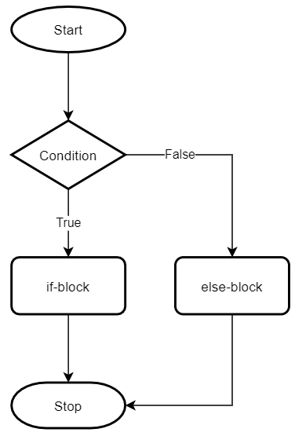
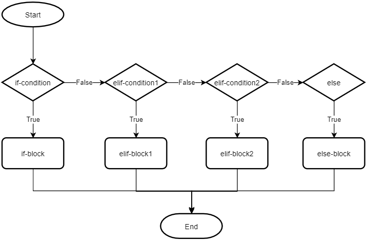

# 🐍 PYTHON DASTURLASH ASOSLARI

# 🧩 8-DARS IF...ELIF...ELSE..

## TARMOQLANISH

📌 Shu vaqtgacha yozgan dasturlarimizga e'tibor bersangiz, dasturimiz yuqoridan pastga qarab qatorma-qator bajarilib keldi. Bu chiziqli dastur deyiladi. Ammo ba'zida shartga qarab kodning bir qismidan boshqa qismiga o'tish zarur bo'ladi. Bunday holat `"tarmoqlanish"` deb ataladi. 


📌 Python dasturlash tilida shart operatorlari (`conditional statements`) dasturda turli vaziyatlarga qarab turli amallarni bajarishga imkon beradi.

## ✅ IF

📌 Python dasturlash tilida `if` operatori **shartni tekshirish** uchun ishlatiladi. Ya'ni, agar biror shart **True** bo‘lsa, unga tegishli kodlar bajariladi. Agar shart **False** bo‘lsa, kod bajarilmaydi.


```python
# Bankdagi hisobdagi pul miqdori
account_balance = 1500  

# Agar balans 1000 dan katta bo‘lsa, foydalanuvchi pul yechishi mumkin
if account_balance > 1000:
    print("You can withdraw money")  # Foydalanuvchiga ruxsat beriladi
```

```python
# Foydalanuvchining savatidagi umumiy mahsulot narxi
total_price = 250  

# Agar narx 200 dan katta bo‘lsa, bepul yetkazib berish taklif qilinadi
if total_price > 200:
    print("You qualify for free shipping")  # Bepul yetkazib berish haqida xabar
```

```python
# Foydalanuvchi kiritgan parol
password = "mysecurepass"  

# Agar parol uzunligi 8 belgidan ko‘p bo‘lsa, kuchli parol deb baholanadi
if len(password) > 8:
    print("Your password is strong")  # Kuchli parol haqida xabar
```

## ✅ ELSE



📌 Python dasturlash tilida `else` operatori `if` dan keyin yoziladi. Agar `if` dagi **False** bo;lsa, else ichidagi kodlar bajariladi.


```python
# Foydalanuvchi shakarmi tanladi (ha yoki yo'q)
wants_sugar = True  

# Agar foydalanuvchi shakar istasa
if wants_sugar:
    print("Adding sugar to your coffee")  # Qahvaga shakar qo‘shiladi
else:
    print("Preparing your coffee without sugar")  # Shakarsiz qahva tayyorlanadi
```

```python
# Telefon quvvati foizda
battery_percentage = 15  

# Agar quvvat 20 dan kam bo‘lsa, ogohlantirish chiqariladi
if battery_percentage < 20:
    print("Battery is low. Please charge your phone.")  # Quvvat kamligi haqida ogohlantirish
else:
    print("Battery level is sufficient.")  # Quvvat yetarli
```

```python
# Talabaning olgan bahosi
exam_score = 72  

# Agar baho 60 yoki undan yuqori bo‘lsa, imtihondan o‘tgan hisoblanadi
if exam_score >= 60:
    print("You passed the exam!")  # O‘tdi degan xabar
else:
    print("You failed the exam.")  # Yiqildi degan xabar
```

## ✅ LIST BILAN ISHLASH

🎯 Onlayn do‘konda foydalanuvchi savatida kamida 1 mahsulot borligini va maxsus mahsulot bor-yo‘qligini tekshirish:

```python
# Xaridor savatidagi mahsulotlar ro'yxati
shopping_cart = ["bread", "sugar", "apple"]

# Agar savatda kamida bitta mahsulot bo‘lsa
if shopping_cart:
    print("The cart has items")  # Savatda mahsulot borligi haqida xabar
else:
    print("The cart is empty")  # Savat bo‘shligi haqida xabar


# Agar savatda 'sugar' bo‘lsa
if "sugar" in shopping_cart:
    print("Sugar is in the cart")  # Shakar mavjudligi haqida xabar
else:
    print("Sugar is not in the cart")  # Shakar yo‘qligi haqida xabar


# Agar savatda 5 ta yoki undan ko‘p mahsulot bo‘lsa, bepul yetkazib berish
if len(shopping_cart) >= 5:
    print("Free delivery available")  # Bepul yetkazib berish
else:
    print("Delivery charges apply")  # Pullik yetkazib berish
```

## ✅ TUPLE BILAN ISHLASH

🎯 Foydalanuvchining geolokatsiyasi asosida joylashuvni aniqlash

```python
# Foydalanuvchining geografik joylashuvi (kenglik, uzunlik)
user_location = (41.2995, 69.2401)  # Toshkent koordinatalari

# Agar joylashuv ma'lum bo‘lsa (ya'ni tuple bo‘sh bo‘lmasa)
if user_location:
    print("Location detected")  # Joylashuv aniqlandi
else:
    print("Location not available")  # Joylashuv topilmadi


# Foydalanuvchi O'zbekiston hududida joylashganmi – kenglik bo‘yicha tekshiramiz
if 41.0 <= user_location[0] <= 42.0:
    print("User is located in Uzbekistan")  # Foydalanuvchi O‘zbekistonda
else:
    print("User is outside of Uzbekistan")  # Foydalanuvchi boshqa mamlakatda
```


## ✅ SET BILAN ISHLASH

🎯  Saytga kirgan foydalanuvchilar `ID` raqamlari setda saqlanadi, va admin ularni tekshiradi.

```python
# Bugun saytga kirgan foydalanuvchilarning ID raqamlari (takrorlanmaydi)
active_user_ids = {101, 202, 303, 404}

# Agar kamida bitta foydalanuvchi saytga kirgan bo‘lsa
if active_user_ids:
    print("Bugun saytga foydalanuvchilar kirgan")  # Foydalanuvchilar bor

# Aks holda, hech kim kirmagan bo‘ladi
else:
    print("Hali hech kim saytga kirmagan")  # Set bo‘sh


# Agar 202-ID foydalanuvchi kirgan bo‘lsa
if 202 in active_user_ids:
    print("202-ID foydalanuvchi tizimga kirgan")  # Shu ID topildi
else:
    print("202-ID foydalanuvchi hali kirmagan")  # Shu ID yo‘q

# Bugun kirgan foydalanuvchilar soni 100 dan oshgan bo‘lsa
if len(active_user_ids) > 100:
    print("Yuqori aktivlik")  # Juda ko‘p foydalanuvchi
else:
    print("Oddiy kun")  # Odatdagi foydalanuvchi soni
```


## ✅ DICTIONARY BILAN ISHLASH:

🎯 Foydalanuvchi registratsiya qilganda u haqidagi ma’lumotlar dictionaryda saqlanadi.

```python
# Dictionary: foydalanuvchining asosiy profili
user_profile = {
    "name": "Umid",
    "email": "umid@example.com",
    "age": 23
}

# Agar foydalanuvchiga oid ma'lumotlar mavjud bo‘lsa
if user_profile:
    print("User profile data is available")  # Ma'lumotlar bor
else:
    print("No user data found")  # Ma'lumotlar yo‘q


# Agar email kaliti mavjud bo‘lsa
if "email" in user_profile:
    print("Email is provided")  # Email mavjud
else:
    print("Email is missing")  # Email kiritilmagan


# Agar foydalanuvchi yoshi 18 yoki undan katta bo‘lsa
if user_profile.get("age", 0) >= 18:
    print("User is an adult")  # Voyaga yetgan
else:
    print("User is a minor")  # Voyaga yetmagan


# Profil to‘liq deb hisoblanadi, agar kamida 3 ta kalit bo‘lsa
if len(user_profile) >= 3:
    print("Profile is complete")  # To‘liq profil
else:
    print("Profile is incomplete")  # To‘liq bo‘lmagan profil
```


## ✅ ELIF



`elif` — bu else if degan so‘zning qisqargan ko‘rinishi. U **bir nechta shartlarni ketma-ket tekshirish** uchun ishlatiladi. Agar `if` sharti **False** bo'lsa, `elif` sharti tekshiriladi.


🎯 Smart uydagi HVAC tizimi xonadagi haroratga qarab qaror qabul qiladi.

```python
# Current room temperature in Celsius
room_temperature = 28  # Xona harorati, Celsiy bo‘yicha

# Agar xona juda sovuq bo‘lsa (18°C dan past)
if room_temperature < 18:
    print("Heating system should be turned ON")  # Isitish tizimi yoqiladi

# Agar xona juda issiq bo‘lsa (26°C dan yuqori)
elif room_temperature > 26:
    print("Cooling system should be turned ON")  # Sovutish tizimi yoqiladi

# Aks holda, harorat me'yorda
else:
    print("Temperature is optimal, no action needed")  # Hech qanday tizim yoqilmaydi
```

🎯 Onlayn do‘konda har bir buyurtmaning holatini aniqlash uchun ishlatiladi.

```python
# Order status (current stage of delivery process)
order_status = "shipped"  # "yuborilgan" degani

# Agar buyurtma qabul qilingan bo‘lsa
if order_status == "received":
    print("Your order has been received and will be prepared soon.")  # Buyurtma qabul qilindi

# Agar tayyorlanayotgan bo‘lsa
elif order_status == "preparing":
    print("Your order is currently being prepared.")  # Tayyorlanmoqda

# Agar yuborilgan bo‘lsa
elif order_status == "shipped":
    print("Your order has been shipped.")  # Yo‘lga chiqdi

# Agar yetkazilgan bo‘lsa
elif order_status == "delivered":
    print("Your order has been delivered.")  # Yetkazildi

# Nomalum holatlar uchun
else:
    print("Unknown order status.")  # Noma'lum status
```


## ✅ BIR NECHTA SHARTLARNI  BIRGA ISHLATISH

🎯 Login tizimi – foydalanuvchini tekshirish. Foydalanuvchi login va parolni to‘g‘ri kiritganmi, tekshiramiz.

```python
# Foydalanuvchi kiritgan login va parol
entered_username = "umid"
entered_password = "python123"

# To‘g‘ri login va parol kiritilgan bo‘lsa
if entered_username == "umid" and entered_password == "python123":
    print("Welcome, Umid!")  # Xush kelibsiz!

# Login to‘g‘ri, lekin parol noto‘g‘ri bo‘lsa
elif entered_username == "umid" and entered_password != "python123":
    print("Incorrect password")  # Parol xato

# Parol to‘g‘ri, lekin login noto‘g‘ri bo‘lsa
elif entered_username != "umid" and entered_password == "python123":
    print("Incorrect username")  # Login xato

# Ikkalasi ham noto‘g‘ri bo‘lsa
else:
    print("Incorrect username and password")  # Ikkalasi ham xato
```

🎯 Ob-havo ilovasi – kiyim tavsiyasi. Foydalanuvchiga havo haroratiga qarab tavsiya beriladi.

```python
# Ob-havo holati: havo harorati va yomg‘ir yog‘yaptimi yo‘qmi
temperature = 32  # Havo harorati (°C)
is_raining = False  # Yomg‘ir yog‘ayotgan bo‘lsa True, aks holda False

# Juda sovuq bo‘lsa (0°C yoki undan past)
if temperature <= 0:
    print("It is very cold. Wear warm clothes.")  # Qalin kiyim tavsiya qilinadi

# Salqin bo‘lsa (1°C dan 15°C gacha)
elif temperature <= 15:
    print("It's cool outside. A light jacket is recommended.")  # Yengil kurtka kiying

# Juda issiq yoki yomg‘irli bo‘lsa
elif temperature >= 30 or is_raining:
    print("Hot or rainy weather – wear light clothes and carry an umbrella.")  # Soyabon va yengil kiyim

# Ob-havo normal bo‘lsa
else:
    print("The weather is normal. Regular clothes are fine.")  # Oddiy kiyim yetarli
```

🎯 Internet tezligiga qarab videoning sifat darajasi belgilanadi.

```python
# Foydalanuvchi internetga ulanmagan bo‘lsa, bu True/False qiymatni bildiradi
is_connected = True

# Internet tezligi (Mbit/s)
internet_speed = 2.5

# Agar internetga ulanmagan bo‘lsa
if not is_connected:
    print("Not connected to the internet")  # Internet yo‘q

# Juda past tezlikda
elif internet_speed < 1:
    print("Video quality: 144p (very low)")  # Juda past sifat

# O‘rtacha past tezlikda
elif internet_speed < 3:
    print("Video quality: 360p (low)")  # Past sifat

# O‘rta tezlikda
elif internet_speed < 6:
    print("Video quality: 720p (medium)")  # O‘rtacha sifat

# Yuqori tezlikda
else:
    print("Video quality: 1080p (high)")  # Yuqori sifat
```


## SHART OPERATORLARINI ICHMA-ICH JOYLASH (Nested Conditions)
Shart operatorlarini bir-birining ichiga joylashtirish orqali murakkabroq mantiqiy holatlar yaratish mumkin.

```python
x = 8

if x > 5:
    if x < 10:
        print("x 5 dan katta va 10 dan kichik")
    else:
        print("x 10 dan katta yoki teng")
else:
    print("x 5 dan kichik yoki teng")
```

- Ko'p darajali ichma-ich shart operatorlari:
```python
x = 10
y = 20
z = 30

if x > 5:  # Birinchi darajadagi shart
    if y > 15:  # Ikkinchi darajadagi shart
        if z > 25:  # Uchinchi darajadagi shart
            print("x 5 dan katta, y 15 dan katta, va z 25 dan katta")
        else:
            print("x 5 dan katta, y 15 dan katta, lekin z 25 dan kichik yoki teng")
    else:
        print("x 5 dan katta, lekin y 15 dan kichik yoki teng")
else:
    print("x 5 dan kichik yoki teng")
```

- Ichma-ich shart operatorlari bilan foydalanuvchi `login`, `parol`ini tekshirish:
```python
username = "admin"
password = "1234"

if username == "admin":  # Birinchi darajadagi shart
    if password == "1234":  # Ikkinchi darajadagi shart
        print("Tizimga kirdingiz!")
    else:
        print("Noto'g'ri parol!")
else:
    print("Noto'g'ri foydalanuvchi nomi!")
```

## AMALIYOT

- Sonning musbat, manfiy yoki nol ekanligini aniqlash.
    - Foydalanuvchi kiritgan sonning musbat, manfiy yoki nol ekanligini aniqlaydigan dastur yozing.
- Talabaning bahosini aniqlash:
    - Talabaning o'rtacha bahosi asosida uning bahosini aniqlaydigan dastur yozing. Shartlar quyidagicha bo'lsin:
        - 90 va undan yuqori: "A"
        - 80 va undan yuqori: "B"
        - 70 va undan yuqori: "C"
        - 60 va undan yuqori: "D"
        - 60 dan past: "F"
- Yilning faslini aniqlash:
    - Foydalanuvchi kiritgan oy raqami asosida qaysi fasl ekanligini aniqlaydigan dastur yozing:
        - 12, 1, 2 - Qish
        - 3, 4, 5 - Bahor
        - 6, 7, 8 - Yoz
        - 9, 10, 11 - Kuz
- Foydalanuvchi login tizimi:
    - Foydalanuvchi login va parol kiritadi, va tizim ularning to'g'ri yoki noto'g'ri ekanligini tekshiradi. Agar login "admin" va parol "1234" bo'lsa, tizimga kirish muvaffaqiyatli bo'ladi, aks holda xato xabarini chiqaradi.
- Sonning juft yoki toq ekanligini aniqlash.
    - Foydalanuvchi kiritgan sonning juft yoki toq ekanligini aniqlaydigan dastur yozing.